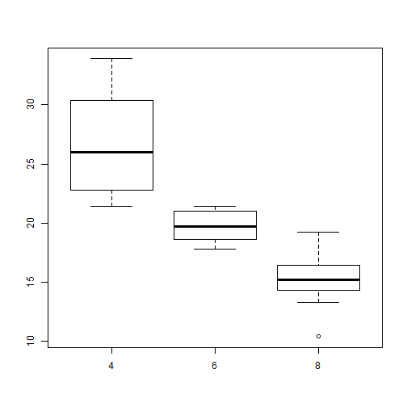

## Read-And-Delete

1. Edit YAML front matter
2. Write using R Markdown
3. Use an empty line followed by three dashes to separate slides!

--- .class #id 

## Slide 2

--- &twocol w1:20% w2:80%

## Header Across The Full Width of Both of the Columns

***=left

- list
- on the left 
- side

***=right

Table       |Table        |Table      |Table           |
------------|-------------|-----------|----------------|
First Row   | 1234567     |0.82       |5.95            |
Second Row  | 89          |0.69       |5.02            |
Third Row   | 100         |0.72       |7.0             |

--- &twocol w1:50% w2:50%

## R Code Chunk Example

***=left
Some data and a plot:


```r
data(mtcars)
with(mtcars, boxplot(mpg ~ factor(cyl)))
```


***=right
 

